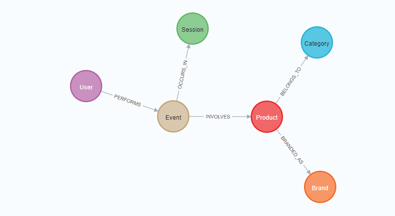
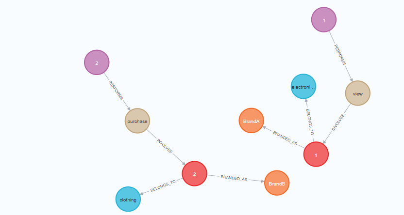

# Graph Database Schema instead of Relational Database Schema

## Visual Representation of Graph Database Schema

### Example of Two Users' Events

## Node Properties

### User Nodes

- `user_id`: Integer (Unique identifier for each user)

### Product Nodes

- `product_id`: Integer (Unique identifier for each product)
- `price`: Integer (Price of the product)

### Event Nodes

- `event_type`: String (Type of event, e.g., 'view', 'purchase')
- `event_time`: Timestamp (Time when the event occurred)

### Category Nodes

- `category_code`: String (Category of the product, e.g., 'electronics', 'clothing')

### Brand Nodes

- `brand`: String (Brand of the product, e.g., 'BrandA', 'BrandB')

### Session Nodes

- `user_session`: String (Unique session identifier)

## Graph Database Schema Explanation

### Nodes and Their Relationships

- **User Node**: Represents a customer on the e-commerce platform. Each user can initiate multiple sessions.
- **Session Node**: Each session is initiated by a user. A session contains multiple events, making it central to understanding user behavior within a particular timeframe.
- **Event Node**: Events are the actions taken during a session. They can be any of "view", "cart", or "purchase". Each event involves a specific product.
- **Product Node**: Each product involved in an event has a brand and belongs to a category.
- **Category Node**: Represents the category of products, helping in the classification and organization of products.
- **Brand Node**: Represents the brand associated with a product.
