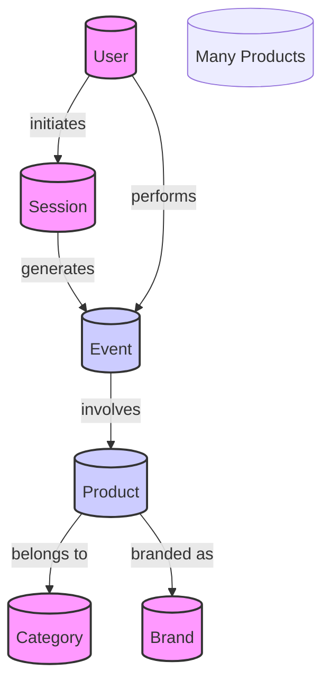

## Graph Database Schema Explanation

### Nodes and Their Relationships

- **User Node**: Represents a customer on the e-commerce platform. Each user can initiate multiple sessions.
- **Session Node**: Each session is initiated by a user. A session contains multiple events, making it central to understanding user behavior within a particular timeframe.
- **Event Node**: Events are the actions taken during a session. They can be any of "view", "cart", or "purchase". Each event involves a specific product.
- **Product Node**: Each product involved in an event has a brand and belongs to a category.
- **Category Node**: Represents the category of products, helping in the classification and organization of products.
- **Brand Node**: Represents the brand associated with a product.

### Schema Design Considerations

- **One-to-Many Relationships**: Indicated by the relationships where one user can initiate multiple sessions, one session can generate multiple events, and one product can be involved in multiple events.
- **Many-to-One Relationships**: Products relate back to their categories and brands. A single category can encompass numerous products, and a single brand can be associated with many products.

